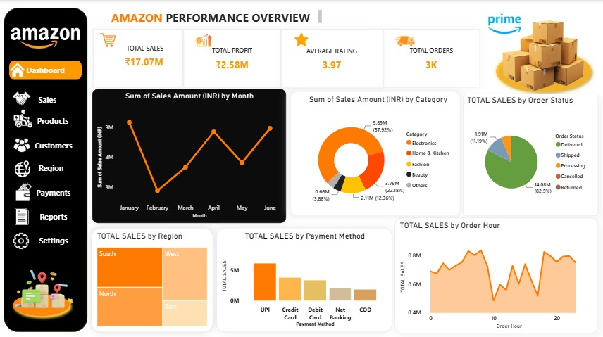

### 📦 Amazon Sales Performance Dashboard

### Overview
Built an interactive Power BI dashboard analyzing Amazon sales performance across categories, regions, and payment methods using Excel & DAX.

### Key Metrics
- **Total Sales:** ₹17.07M
- **Total Profit:** ₹2.58M
- **Total Orders:** 3,000
- **Average Rating:** 3.97/5

### Key Insights
- Electronics generated the highest sales (₹9.89M) and profit (₹1.49M)
- South region led in sales (₹5.13M), followed closely by North (₹5.04M)
- UPI was the most preferred payment method (₹6.1M in sales)
- Prime customers generated 26% higher sales than Non-Prime customers
- Q2 outperformed Q1 in profit (₹1.31M vs ₹1.26M)

### Tools Used
Excel (data cleaning, pivot tables) • Power BI (DAX measures, interactive visuals)

### Project Report
[📄 Full Project Report (PDF)](https://drive.google.com/file/d/11o2JcdgL4owf_rif4zIPyp5XumdXT5tF/view?usp=drivesdk)

📦 Amazon Sales Performance Dashboard — Analyzed cancellations & returns revenue impact using Excel (data cleaning, pivot tables) & Power BI (DAX, interactive dashboard)

